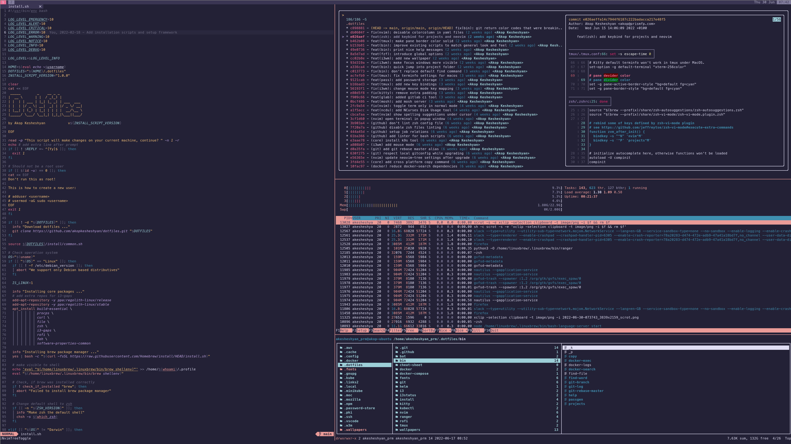

# Dotfiles


My highly personalized productivity setup for Linux and Mac OS inspired by [Rose Pine](https://rosepinetheme.com/) vibes. 

The main idea is to have a highly portable setup, that can be run the same way on different devices, including tablets and remote servers. 

## System requirements
As I'm using [homebrew package manager](https://brew.sh) for maintaining packages, **only MacOS and Debian** are currently supported. 

> Using Homebrew in Linux environment may look controversial, however, I find it less trade-off when it comes to maintaining modern versions of 
> all packages on both OSX and Unix.

## Install
For the first-time install use a simple script that will download and install all required packages. It covers most  and can be considered as 
a primary way of installation.

```sh
/bin/bash -c "$(curl -fsSL https://raw.githubusercontent.com/akopkesheshyan/dotfiles/HEAD/install.sh)"
```
If you are not able to perform a complete installation, or you want to run dotfiles on unsupported platforms (ex. Windows), you can try docker image.

```sh
docker run -it -v ./Projects:/home/akop/Projects akopkesheshyan/dotfiles
```
It will create a container that you can access with your favourite terminal application using SSH protocol.

## List of packages
Right from the box, you will get configured OS with this list of pre-installed software. 

### Dev tools
- [delta](https://github.com/dandavison/delta) A syntax-highlighting pager for git, diff and grep output
- [gitlab-ci-local](https://github.com/firecow/gitlab-ci-local) Run gitlab pipelines locally
- [glab](https://github.com/profclems/glab) Work with Gitlab issues, merge requests, watch running pipelines directly from your CLI
- [neovim](https://neovim.io) Vim based IDE 
- [shellcheck](https://github.com/koalaman/shellcheck) A shell script static analysis tool

### Infrastructure management
- [awscli](https://aws.amazon.com/cli/) Official Amazon AWS command-line interface
- [docker-compose](https://docs.docker.com/compose) Isolated development environments using Docker
- [docker](https://www.docker.com) Pack, ship and run any application as a lightweight container
- [helm](https://helm.sh) Kubernetes package manager
- [k9s](https://k9scli.io) Kubernetes cli tool to  manage clusters
- [kubernetes-cli](https://kubernetes.io) Kubernetes command-line interface
- [minikube](https://minikube.sigs.k8s.io/docs) Run a Kubernetes cluster locally
- [s3cmd](https://s3tools.org/s3cmd) Command-line tool for the Amazon S3 service

### System tools
- [bat](https://github.com/sharkdp/bat) A cat clone with wings
- [ctop](https://github.com/bcicen/ctop) Top-like interface for container metrics
- [exa](https://github.com/ogham/exa) A modern replacement for ls command
- [feh](https://feh.finalrewind.org/) A lightweight image viewer
- [fff](https://github.com/dylanaraps/fff) A simple file manager written in bash
- [fzf](https://github.com/junegunn/fzf) A command-line fuzzy finder
- [htop](https://htop.dev) Improved version of system top
- [mosh](https://mosh.org) Remote terminal application
- [ncdu](https://dev.yorhel.nl/ncdu) Tool for analysing disk usage
- [pass](https://www.passwordstore.org/) Password manager
- [ripgrep](https://github.com/BurntSushi/ripgrep) Search tool like grep and the silver searcher
- [xclip](https://github.com/astrand/xclip) Access X11 clipboards from the command-line
- [zsh-autosuggestions](https://github.com/zsh-users/zsh-autosuggestions) Fish-like fast/unobtrusive autosuggestions for zsh
- [zsh-vi-mode](https://github.com/jeffreytse/zsh-vi-mode) Better and friendly vi(vim) mode plugin for ZSH

### Windows manager
- [i3-gaps](https://github.com/Airblader/i3) i3-gaps is a fork of i3wm, a tiling window manager for X11
- [rofi](https://github.com/davatorium/rofi) A window switcher, Application launcher and dmenu replacement. 
- [feh]()
- [tmux](https://github.com/tmux/tmux/wiki) Terminal multiplexer

### Languages and compilers
- Python 3.9 and 3.10
- Go
- Typescript

## Update
If you have already installed dotfiles, you can frequently run an update script that will bring the latest changes and dependencies to your machine. 

```sh 
dotfiles update
```

> As Homebrew is currently not supporting version definitions, you will always get the latest available version of the package directly from the server. 
> It is impossible to guarantee that all existing software is compatible with each other, so I suggest not to run it too often.

## Shortcuts and aliases

### General

| Command  | Description                                 |
| -------- | ------------------------------------------- |
| Ctrl+n   | Open neovim in current folder               |
| Ctrl+p   | List all projects                           |
| Ctrl+f   | Find file by its content                    |
| Ctrl+e   | Open file explorer                          |
| f        | Find file by its content                    |
| ff       | Find file by name                           |
| help     | Nice way to explore command help manual     |
| passgen  | Generate random secure password             |
| copy     | Cross-platform copy to clipboard            |

### Git

| Command  | Description                                 |
| -------- | ------------------------------------------- |
| ga       | git add                                     |
| gap      | git add -p                                  |
| gaa      | git add -A                                  |
| gcm      | git commit -m                               |
| gcam     | git add -A && git commit -m                 |
| gs       | git status                                  |
| gp       | git push                                    |
| gpf      | git push --force                            |
| gpl      | git pull                                    |
| gf       | git fetch                                   |
| gl       | git-log                                     |
| gd       | git diff                                    |
| gb       | git-branch                                  |
| gcb      | git checkout -b                             |
| grm      | git-rebase-master                           |
| gr       | git rebase -i                               |

### Docker

| Command | Description                                  |
| ------- | -------------------------------------------- |
| d       | docker                                  |
| de      | docker exec                                  |
| dk      | docker kill                                  |
| dl      | docker logs                                  |
| dps     | list all running containers                  |
| ds      | search docker hub from terminal              |

### Kubernetes

| Command | Description                                  |
| ------- | -------------------------------------------- |
| k       | kubectl                                      |
| kg      | kubectl get all                              |
| kgp     | kubectl get pods                             |
| kgs     | kubectl get services                         |
| kdp     | kubectl describe pods                        |
| kds     | kubectl describe services                    |
| kl      | kubectl logs                                 |


